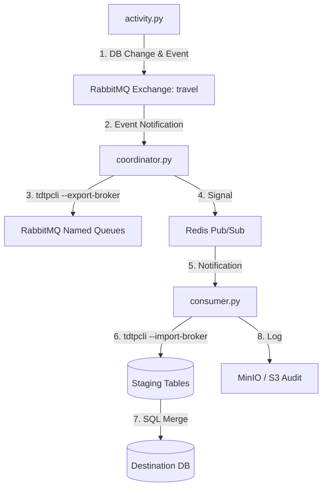

# Travel Agency: Event-Driven Data Synchronization

A reference example of a distributed data synchronization system built on **TDTP Framework**.  
Three independent nodes — **Central**, **Branch**, **Airline** — exchange data through RabbitMQ  
using **Event-Driven Architecture (EDA)**: database changes trigger high-throughput sync pipelines.

---

## Architecture

Three nodes, each with its own PostgreSQL database:

| Node | Port | Role |
|------|------|------|
| **Central Office** | 5432 | Master catalogs (tours, countries, guides); aggregates sales from all branches |
| **Branch Office** | 5433 | Regional office: manages clients, processes sales, receives catalog updates from Central |
| **Airline Partner** | 5434 | External supplier: pushes flight and booking data to Central |

### Data Flow



### Sync Map

| Direction | Entities | Sync Type |
|-----------|----------|-----------|
| **Airline → Central** | Flights, Bookings | Incremental (`last_updated`) |
| **Central → Branch** | Countries, Tours, Guides, Schedule | Mixed (Full / Incremental) |
| **Branch → Central** | Clients, Sales | Incremental |

---

## Components

### `activity.py` — Traffic Simulator
Emulates real user activity across all nodes:
- Registers new clients and sales in **Branch**
- Updates catalogs (prices, guide statuses) in **Central**
- Changes flight statuses and creates bookings in **Airline**
- After each DB write: publishes a short JSON event to RabbitMQ exchange `travel`  
  with a routing key (e.g. `branch.sales.created`)

### `coordinator.py` — Export Coordinator
Bridge between events and data:
- Listens to RabbitMQ exchange `travel`
- On event: determines which data to transfer (via `ROUTE_MAP`)
- Runs `tdtpcli --export-broker` — reads changed records (using incremental fields like `last_updated`),  
  compresses and sends to the target RabbitMQ queue
- Publishes a readiness signal to Redis Pub/Sub

### `consumer.py` — Import Consumer
Handles delivery and integration:
- Listens to Redis notification channel
- Runs `tdtpcli --import-broker` — reads from RabbitMQ queue into staging tables
- Calls `merge_...` SQL procedures for atomic upsert from staging to main tables
- Writes audit record (transaction log) to S3 bucket `travel-agency`

---

## Quick Start

### Step 1: Infrastructure

Ensure the following are running:

```
PostgreSQL   — 3 instances on ports 5432, 5433, 5434
RabbitMQ     — credentials: tdtp / tdtp
Redis        — port 6379
MinIO        — S3 on port 8333
```

### Step 2: Initialize Databases

Run SQL scripts from `setup/` in order:

```bash
psql -p 5432 -f setup/setup_database_postgres.sql    # Central
psql -p 5433 -f setup/setup_branch_postgres.sql      # Branch
psql -p 5434 -f setup/setup_airline_postgres.sql     # Airline
psql -p 5432 -f setup/setup_central_additions.sql    # Central additions
psql -p 5432 -f setup/setup_staging_central.sql      # Central staging tables
psql -p 5433 -f setup/setup_staging_branch.sql       # Branch staging tables
psql -p 5432 -f setup/seed_central_postgres.sql      # Seed reference data
```

Or use the populate scripts:

```bash
python setup/populate_data_postgres.py
```

### Step 3: Start Services

Run each in a separate terminal:

```bash
# Export coordinator
python coordinator.py

# Import consumers
python consumer.py --node central
python consumer.py --node branch

# Traffic simulators
python activity.py --node airline --interval 5
python activity.py --node branch  --interval 3
python activity.py --node central --interval 10
```

---

## Configuration

All TDTP settings (compression, retries, circuit breaker) are in `configs/`:

| File pattern | Used by | Purpose |
|---|---|---|
| `configs/config_central.yaml` | `consumer.py` | Central DB connection |
| `configs/config_branch.yaml` | `consumer.py` | Branch DB connection |
| `configs/config_src_tdtp_sync_*.yaml` | `coordinator.py` | Source configs per entity |
| `configs/config_dst_tdtp_sync_*.yaml` | `consumer.py` | Destination configs per entity |
| `configs/config_broker_*.yaml` | both | RabbitMQ broker settings |

Default settings:
- Compression: `compress: true`, level 3 (zstd)
- Resilience: exponential retry on broker or DB failure

---

## Notes

### Staging Tables and Data Types

**Rule:** column type in the staging table must match the source type.  
TDTP stores NULL as marker `[NULL]` in the packet body and restores it to `nil` on import —  
but only if the destination column type allows it (not `TEXT`).

```sql
-- Correct: TIMESTAMP NULL — TDTP handles [NULL] → NULL automatically
cancellation_date  TIMESTAMP NULL,

-- Wrong: TEXT causes pgx error "unable to encode time.Time into text"
-- cancellation_date  TEXT,
```

The merge procedure receives `NULL` directly — no additional casting needed:

```sql
-- Correct (after fix):
cancellation_date,

-- Not needed (old workaround):
-- NULLIF(NULLIF(cancellation_date, ''), '[NULL]')::TIMESTAMP
```

### Pipeline YAMLs

The `pipelines/` directory contains `--pipeline` configs for multi-source ETL:
- `extract_*.yaml` — pull data from MSSQL source into S3
- `load_*.yaml` — load from S3 into PostgreSQL destination

These use the `--pipeline` command and are independent of the broker-based sync above.
