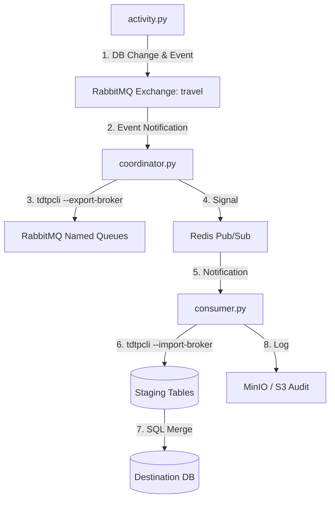

# Travel Agency: Event-Driven Data Synchronization Example

Этот пример демонстрирует построение распределенной системы обмена данными между тремя независимыми узлами (**Central**, **Branch**, **Airline**) с использованием **TDTP Framework**. 

Система построена на принципах **Event-Driven Architecture (EDA)**: изменения в базах данных инициируют процессы высокопроизводительной синхронизации через RabbitMQ.

## 🏗 Архитектура системы

Система состоит из трех логических узлов, каждый из которых имеет свою базу данных PostgreSQL:

1.  **Central Office (Порт 5432):** Центральный узел. Хранит мастер-каталоги (туры, страны, гиды) и агрегирует данные о продажах со всех филиалов.
2.  **Branch Office (Порт 5433):** Региональный филиал. Работает с клиентами, оформляет продажи, получает обновления каталогов из центра.
3.  **Airline Partner (Порт 5434):** Внешний поставщик (авиакомпания). Передает данные о рейсах и бронированиях в центральный офис.

### Схема взаимодействия


## 🧩 Основные компоненты

### 1. Симулятор активности (`activity.py`)
Эмулирует реальную работу пользователей в узлах:
*   Регистрирует новых клиентов и продажи в **Branch**.
*   Обновляет каталоги (цены, статусы гидов) в **Central**.
*   Меняет статусы рейсов и создает бронирования в **Airline**.
*   **Действие:** После записи в БД отправляет короткое JSON-сообщение в RabbitMQ exchange `travel` с соответствующим routing key (например, `branch.sales.created`).

### 2. Координатор экспорта (`coordinator.py`)
Служит «мостом» между событиями и данными:
*   Слушает exchange `travel`.
*   При получении события определяет, какие данные нужно передать (согласно `ROUTE_MAP`).
*   Запускает `tdtpcli.exe --export-broker`, который вычитывает измененные записи (используя инкрементальные поля, такие как `last_updated`) и отправляет их в сжатом виде в целевую очередь RabbitMQ.
*   Публикует сигнал о готовности данных в Redis.

### 3. Консьюмер импорта (`consumer.py`)
Обеспечивает доставку и интеграцию данных:
*   Слушает канал уведомлений в Redis.
*   Запускает `tdtpcli.exe --import-broker` для вычитки данных из очереди RabbitMQ во временные (staging) таблицы целевой БД.
*   Вызывает SQL-процедуры `merge_...` для атомарного обновления основных таблиц из staging.
*   Сохраняет запись о транзакции (аудит) в S3-корзину `travel-agency`.

## 🔄 Потоки данных (Sync Map)

| Направление | Сущность | Тип синхронизации |
| :--- | :--- | :--- |
| **Airline → Central** | Рейсы, Бронирования | Инкрементальная (last\_updated) |
| **Central → Branch** | Страны, Туры, Гиды, Расписание | Смешанная (Full / Incremental) |
| **Branch → Central** | Клиенты, Продажи | Инкрементальная |

## 🚀 Запуск примера

### Шаг 1: Инфраструктура
Убедитесь, что запущены:
*   **PostgreSQL** (3 инстанса или 3 БД на портах 5432, 5433, 5434).
*   **RabbitMQ** (с доступом `tdtp:tdtp`).
*   **Redis** (порт 6379).
*   **MinIO** (S3 на порту 8333).

### Шаг 2: Инициализация БД
Выполните SQL-скрипты для подготовки схем и начальных данных:
1.  `setup_database_postgres.sql` (Central)
2.  `setup_branch_postgres.sql` (Branch)
3.  `setup_airline_postgres.sql` (Airline)
4.  `seed_central_postgres.sql` (Начальные справочники)

### Шаг 3: Запуск сервисов
В разных терминалах запустите:

1.  **Координатор:**
    ```bash
    python coordinator.py
    ```

2.  **Консьюмеры (для каждого узла):**
    ```bash
    python consumer.py --node central
    python consumer.py --node branch
    ```

3.  **Симуляторы (генерация трафика):**
    ```bash
    python activity.py --node airline --interval 5
    python activity.py --node branch --interval 3
    python activity.py --node central --interval 10
    ```

## 🛠 Конфигурация TDTP
Все настройки TDTP (сжатие, ретраи, circuit breaker) вынесены в YAML-файлы:
*   `config_src_...`: Настройки источника для `coordinator.py`.
*   `config_dst_...`: Настройки приемника для `consumer.py`.
*   Сжатие: `compress: true`, уровень 3.
*   Отказоустойчивость: экспоненциальные повторы при сбоях брокера или БД.
