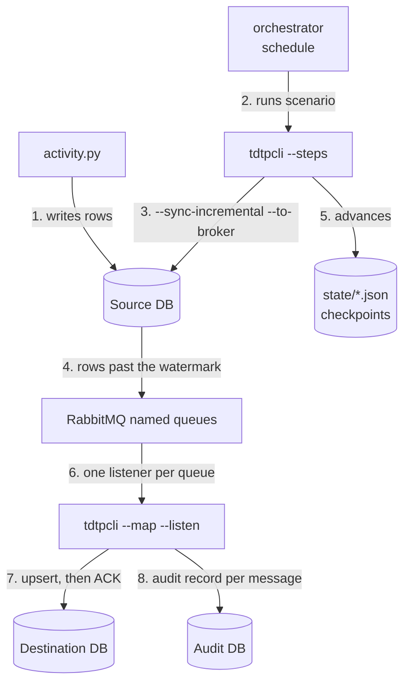

# Travel Agency: Distributed Data Synchronization

A reference example of a distributed data synchronization system built on **TDTP Framework**.  
Three independent nodes — **Central**, **Branch**, **Airline** — exchange data through RabbitMQ.

The only Python left is `activity.py`, which simulates what users do. Everything
that moves data is the framework itself: the orchestrator triggers, `tdtpcli`
exports and imports.

---

## Architecture

Three nodes, each with its own PostgreSQL database:

| Node | Port | Role |
|------|------|------|
| **Central Office** | 5432 | Master catalogs (tours, countries, guides); aggregates sales from all branches |
| **Branch Office** | 5433 | Regional office: manages clients, processes sales, receives catalog updates from Central |
| **Airline Partner** | 5434 | External supplier: pushes flight and booking data to Central |

### Data Flow


```mermaid
graph TD
    A[activity.py] -- "1. writes rows" --> SRC[(Source DB)]
    O[orchestrator<br/>schedule] -- "2. runs scenario" --> ST[tdtpcli --steps]
    ST -- "3. --sync-incremental --to-broker" --> SRC
    SRC -- "4. rows past the watermark" --> Q[RabbitMQ named queues]
    ST -- "5. advances" --> CP[(state/*.json<br/>checkpoints)]
    Q -- "6. one listener per queue" --> CS[tdtpcli --map --listen]
    CS -- "7. upsert, then ACK" --> DB[(Destination DB)]
    CS -- "8. audit record per message" --> AUD[(Audit DB)]
```

Nothing tells the exporter what changed — it asks. Each table's checkpoint holds
the highest `last_updated` already sent, and the next run takes what is above it.
That is why the trigger can be a plain schedule, and why rows written by anyone
other than `activity.py` are picked up just the same.

### Sync Map

| Direction | Entities | Sync Type |
|-----------|----------|-----------|
| **Airline → Central** | Flights, Bookings | Incremental (`last_updated`) |
| **Central → Branch** | Countries, Tours, Guides, Schedule | Mixed (Full / Incremental) |
| **Branch → Central** | Clients, Sales | Incremental |

---

## Components

### `activity.py` — Traffic Simulator
The one remaining Python process, and the only thing here that is not the
framework. Emulates real user activity across all nodes:
- Registers new clients and sales in **Branch**
- Updates catalogs (prices, guide statuses) in **Central**
- Changes flight statuses and creates bookings in **Airline**

It writes to the databases and nothing else. It used to also announce each write
on a RabbitMQ topic exchange so the coordinator would know to export; that
publisher is gone along with its only subscriber.

### `orchestrator.ps1` — Export Trigger

Starts the framework's orchestrator against this directory. It replaced
`coordinator.py`, whose four jobs each went somewhere that already had them:

| coordinator.py did | now |
|---|---|
| kept a cursor per table in Redis, then set it to `datetime.now()` | `state/*.json`, taken from the exported data by `--sync-incremental` |
| held a `ROUTE_MAP` of event → tables, built `--where` by hand | `workflows/sync_out.yaml`, one `--sync-incremental --to-broker` step per table |
| subscribed to a topic exchange and debounced 10s | a schedule in the orchestrator |
| wrote a state key to Redis | the orchestrator's job log, one record with full output per run |

Setting the cursor from `datetime.now()` was a quiet data-loss bug: rows written
between the start of the `SELECT` and the moment `now()` was read landed below
the new watermark and were never sent. `--sync-incremental` takes the watermark
from the rows it actually exported, so a row that was not in the result set
cannot be skipped.

Dropping the event trigger for a schedule looks like a step back and is not. The
event said which *simulated activity* had run, not which rows had changed — it
only worked because `activity.py` was the sole writer. Any other writer changed
rows that no event announced, and `coordinator.py` would never sync them.

**Scenarios must be approved before they run.** Edit a workflow file and its
checksum stops matching the approval, and the schedule skips the run rather than
executing changed content unnoticed. Re-approve with `-Approve`.

### `dashboard.py` — Watching It Run

    python dashboard.py     # then open http://localhost:8100

The one place the whole flow is visible at once. Read-only: it polls four
sources and joins them, and never publishes, consumes, writes to a database or
moves a checkpoint. Kill it mid-flight and nothing notices.

That is why it is allowed to be Python in an example whose data path
deliberately has none — `coordinator.py` was Python that *moved data*; this is
a window. It is not started or stopped by `shutdown.ps1` for the same reason:
it is not part of the pipeline.

| Source | What it contributes |
|---|---|
| orchestrator `:8099` | every run with its outcome, and when each schedule next fires |
| RabbitMQ `:15672` | queue depth, **consumer count**, publish/deliver rates |
| `state/audit_*.db` | messages and rows actually imported, per queue |
| `state/*.json` | the watermark each table has reached |

Each is polled independently and its failure is reported in place, so a stopped
orchestrator does not blank the queue view.

The entity list is not written into the dashboard. It is derived from
`workflows/*.yaml` (which table, which config) and `configs/*.yaml` (which
queue) — the same files the workflow itself uses. A dashboard carrying its own
copy of the topology eventually describes a system that no longer exists.

**What it is actually for** is the failure that has no other symptom: a queue
with messages and *no consumer*. A stalled import looks exactly like a healthy
idle queue if you only watch depth, and the export side keeps reporting success
because its own job did succeed. The dashboard calls it out by name. It also
lists queues no workflow step sends to, which is how leftovers from deleted
scripts surface.

### `mercury.ps1` — Encryption Keys

Packets leave the source encrypted. `security.mercury_url` in each node config
points every command at xZMercury, which binds an AES-256-GCM key to the
packet's UUID; the key lives in Mercury's memory and never touches a file.

    <Header>…<TableName>guides</TableName>…      plain — the queue still routes
    <Schema  encryption="aes-256-gcm">s5fH0gVT… ciphertext
    <Data    encryption="aes-256-gcm"><R>UzBKI7… ciphertext

The header stays readable on purpose: a broker has to route the message, and an
operator has to see which table a stuck packet belongs to, without holding a key.

The URL sits in the config rather than on each command because it is needed
symmetrically — the exporter binds the key, every listener resolves it — and one
stale copy of it silently produces packets the other side cannot open.

**Failure shape worth knowing.** If Mercury is down, the export fails at the
encrypt step and the checkpoint stays put, so nothing is lost. But a packet
already in a queue cannot be opened until Mercury is back: the key is not in the
packet, which is the point.

**This is the mock, and it differs in one way that matters.** It does not sign
its responses, so clients run with `MERCURY_SERVER_SECRET=dev-mode` — set for
you by `orchestrator.ps1`. A real deployment runs real
xZMercury with a real shared secret, and then that variable carries the secret
instead: the verification it currently skips is what proves the key came from
the server you meant, rather than from whoever answered first.

### `workflows/` — What Gets Synced

| File | Trigger | Contents |
|---|---|---|
| `sync_out.yaml` | `@every 15s` | Six tables with a `last_updated`, synced incrementally, all in parallel |
| `sync_reference.yaml` | `@every 5m` | `countries` and `tours`, reloaded whole |

The split is not arbitrary: neither `countries` nor `tours` carries an update
timestamp, only a surrogate key. Tracking the key would pick up new rows and
silently miss every edit to an existing one, so those two are reloaded whole —
and a whole catalogue every 15s to catch a renamed country is not a trade worth
making.

Each file runs on its own too, without the orchestrator:

    tdtpcli --steps workflows/sync_out.yaml

### Import — `workflows/sync_in.yaml`

The receiving half is an orchestrator scenario, same as the sending half. One
step per queue, each draining into its target table.

    tdtpcli --map <mapping> --input broker:// --drain 5s

`--drain` is what makes it schedulable. `--input broker://` on its own takes
exactly one message and could never keep up with a burst; `--listen` never ends
and so can never report a result. `--drain` consumes until the queue has been
empty for the window, then exits with a total — work an orchestrator can own.

This replaced `listeners.ps1` and its eight long-lived daemons. They did the job
correctly, but nothing above them knew they existed: no job record, no approval,
no quota, and a failure showed up only in a terminal nobody was watching. Half
the pipeline was governed and half was not — and it was the ungoverned half that
wrote to the database.

The message is still acknowledged only after the upsert commits, so an
interrupted run returns its message to the queue rather than losing it. Each
step is `on_error: skip`: a queue whose target is down must not hold up the other
seven, and its messages simply wait for the next run.

**What this gives up** is latency below the tick. A row now waits up to the
schedule interval plus the drain window instead of arriving as it is published.
For replication that is worth a job record; where seconds matter, `--listen` is
still the right shape and the tool still has it.

## Quick Start

### Step 1: Infrastructure

Ensure the following are running:

```
PostgreSQL   — 3 instances on ports 5432, 5433, 5434
RabbitMQ     — credentials: tdtp / tdtp
Redis        — port 6379
MinIO        — S3 on port 8333
```

### Step 2: Initialize Databases

Run SQL scripts from `setup/` in order:

```bash
psql -p 5432 -f setup/setup_database_postgres.sql    # Central
psql -p 5433 -f setup/setup_branch_postgres.sql      # Branch
psql -p 5434 -f setup/setup_airline_postgres.sql     # Airline
psql -p 5432 -f setup/setup_central_additions.sql    # Central additions
psql -p 5432 -f setup/setup_staging_central.sql      # Central staging tables
psql -p 5433 -f setup/setup_staging_branch.sql       # Branch staging tables
psql -p 5432 -f setup/seed_central_postgres.sql      # Seed reference data
```

Or use the populate scripts:

```bash
python setup/populate_data_postgres.py
```

### Step 3: Start Services

Run each in a separate terminal:

Build both binaries first — the example runs them from the repository root:

```bash
go build -o tdtpcli.exe ./cmd/tdtpcli/ && go build -o orchestrator.exe ./cmd/orchestrator/
```

Then, each in a separate terminal:

```bash
# Encryption keys — start first: nothing exports without it.
./mercury.ps1

# Export trigger. -Approve is needed on the first run and after editing a workflow.
./orchestrator.ps1 -Approve

# Traffic simulators
python activity.py --node airline --interval 5
python activity.py --node branch  --interval 3
python activity.py --node central --interval 10

# Live view of all of it
python dashboard.py
```

Then open <http://localhost:8100>. Or, without the dashboard:

```bash
curl -s "http://localhost:8099/jobs?limit=5" | python -m json.tool
curl -s http://localhost:8099/schedules
docker exec tdtp-rabbitmq rabbitmqctl list_queues name messages consumers
```

The first run backfills: the checkpoints start empty, so every table sends up to
`--batch-size` rows per tick until it catches up. Steady state is reached within
a few ticks, after which each run carries only what changed.

Stop everything with `./shutdown.ps1`, which stops producing before it stops
consuming and drains the queues in between. Checkpoints in `state/` survive —
delete them only to force a full re-sync.

---

## Configuration

All TDTP settings (compression, retries, circuit breaker) are in `configs/`:

| File pattern | Used by | Purpose |
|---|---|---|
| `configs/config_central.yaml` | `workflows/sync_in.yaml` | Central DB connection + audit sink |
| `configs/config_branch.yaml` | `workflows/sync_in.yaml` | Branch DB connection + audit sink |
| `configs/config_src_tdtp_sync_*.yaml` | `workflows/sync_out.yaml` | Source DB + destination queue per entity |
| `mappings/sync_*.yaml` | `workflows/sync_in.yaml` | Queue + target table per entity |
| `configs/config_broker_*.yaml` | both | RabbitMQ broker settings |
| `orchestrator/runners.yaml` | `orchestrator.ps1` | How the orchestrator invokes `tdtpcli` |
| `schedules/travel.yaml` | `orchestrator.ps1` | Seed schedules (the DB owns them after first run) |
| `state/*.json` | `--sync-incremental` | Checkpoints — the resume point, not a cache |

Default settings:
- Compression: `compress: true`, level 3 (zstd)
- Resilience: exponential retry on broker or DB failure

---

## Notes

### Why the idle tick reports nothing

At rest, `travel-sync-out` reports "no changes" for all six tables. Reaching
that took a framework fix worth knowing about, because the symptom was subtle:
the workflow used to report exactly one row per table forever.

TDTP serialised timestamps as RFC 3339 truncated to whole seconds, while these
`last_updated` columns are Postgres `timestamp`, which keeps microseconds. The
watermark taken from an exported packet was therefore *less precise* than the
column it came from: a row at `11:38:11.52877` produced the watermark
`11:38:11Z`, and `last_updated > '11:38:11Z'` matched that same row again on the
next run. Neither `>` nor `>=` converges when the watermark cannot express the
value it stands for.

Fixed in v1.20.2 — the canonical form is now RFC3339Nano, which is
byte-identical for values with no sub-second component and lossless for those
that have one. Checkpoints written before it hold truncated watermarks; the
first run after upgrading re-sends one row per table and then settles.

### Staging Tables and Data Types

**Rule:** column type in the staging table must match the source type.  
TDTP stores NULL as marker `[NULL]` in the packet body and restores it to `nil` on import —  
but only if the destination column type allows it (not `TEXT`).

```sql
-- Correct: TIMESTAMP NULL — TDTP handles [NULL] → NULL automatically
cancellation_date  TIMESTAMP NULL,

-- Wrong: TEXT causes pgx error "unable to encode time.Time into text"
-- cancellation_date  TEXT,
```

The merge procedure receives `NULL` directly — no additional casting needed:

```sql
-- Correct (after fix):
cancellation_date,

-- Not needed (old workaround):
-- NULLIF(NULLIF(cancellation_date, ''), '[NULL]')::TIMESTAMP
```

### Pipeline YAMLs

The `pipelines/` directory contains `--pipeline` configs for multi-source ETL:
- `extract_*.yaml` — pull data from MSSQL source into S3
- `load_*.yaml` — load from S3 into PostgreSQL destination

These use the `--pipeline` command and are independent of the broker-based sync above.
