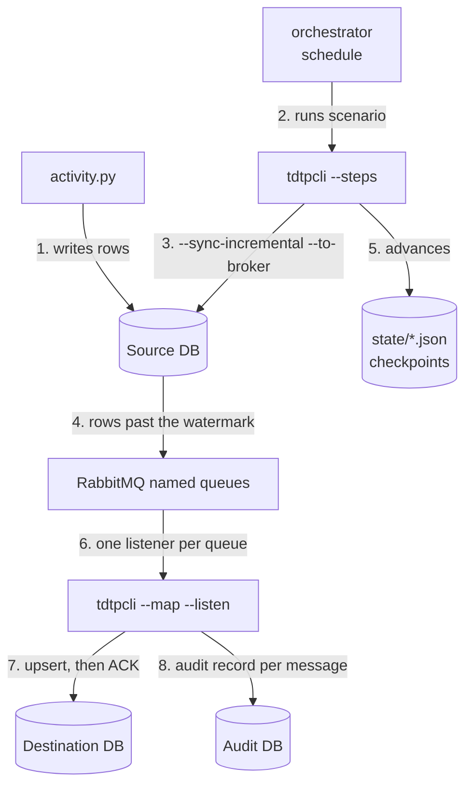

# Travel Agency: Distributed Data Synchronization

A reference example of a distributed data synchronization system built on **TDTP Framework**.  
Three independent nodes — **Central**, **Branch**, **Airline** — exchange data through RabbitMQ.

The only Python left is `activity.py`, which simulates what users do. Everything
that moves data is the framework itself: the orchestrator triggers, `tdtpcli`
exports and imports.

---

## Architecture

Three nodes, each with its own PostgreSQL database:

| Node | Port | Role |
|------|------|------|
| **Central Office** | 5432 | Master catalogs (tours, countries, guides); aggregates sales from all branches |
| **Branch Office** | 5433 | Regional office: manages clients, processes sales, receives catalog updates from Central |
| **Airline Partner** | 5434 | External supplier: pushes flight and booking data to Central |

### Data Flow


```mermaid
graph TD
    A[activity.py] -- "1. writes rows" --> SRC[(Source DB)]
    O[orchestrator<br/>schedule] -- "2. runs scenario" --> ST[tdtpcli --steps]
    ST -- "3. --sync-incremental --to-broker" --> SRC
    SRC -- "4. rows past the watermark" --> Q[RabbitMQ named queues]
    ST -- "5. advances" --> CP[(state/*.json<br/>checkpoints)]
    Q -- "6. one listener per queue" --> CS[tdtpcli --map --listen]
    CS -- "7. upsert, then ACK" --> DB[(Destination DB)]
    CS -- "8. audit record per message" --> AUD[(Audit DB)]
```

Nothing tells the exporter what changed — it asks. Each table's checkpoint holds
the highest `last_updated` already sent, and the next run takes what is above it.
That is why the trigger can be a plain schedule, and why rows written by anyone
other than `activity.py` are picked up just the same.

### Sync Map

| Direction | Entities | Sync Type |
|-----------|----------|-----------|
| **Airline → Central** | Flights, Bookings | Incremental (`last_updated`) |
| **Central → Branch** | Countries, Tours, Guides, Schedule | Mixed (Full / Incremental) |
| **Branch → Central** | Clients, Sales | Incremental |

---

## Components

### `activity.py` — Traffic Simulator
The one remaining Python process, and the only thing here that is not the
framework. Emulates real user activity across all nodes:
- Registers new clients and sales in **Branch**
- Updates catalogs (prices, guide statuses) in **Central**
- Changes flight statuses and creates bookings in **Airline**

It writes to the databases and nothing else. It used to also announce each write
on a RabbitMQ topic exchange so the coordinator would know to export; that
publisher is gone along with its only subscriber.

### `orchestrator.ps1` — Export Trigger

Starts the framework's orchestrator against this directory. It replaced
`coordinator.py`, whose four jobs each went somewhere that already had them:

| coordinator.py did | now |
|---|---|
| kept a cursor per table in Redis, then set it to `datetime.now()` | `state/*.json`, taken from the exported data by `--sync-incremental` |
| held a `ROUTE_MAP` of event → tables, built `--where` by hand | `workflows/sync_out.yaml`, one `--sync-incremental --to-broker` step per table |
| subscribed to a topic exchange and debounced 10s | a schedule in the orchestrator |
| wrote a state key to Redis | the orchestrator's job log, one record with full output per run |

Setting the cursor from `datetime.now()` was a quiet data-loss bug: rows written
between the start of the `SELECT` and the moment `now()` was read landed below
the new watermark and were never sent. `--sync-incremental` takes the watermark
from the rows it actually exported, so a row that was not in the result set
cannot be skipped.

Dropping the event trigger for a schedule looks like a step back and is not. The
event said which *simulated activity* had run, not which rows had changed — it
only worked because `activity.py` was the sole writer. Any other writer changed
rows that no event announced, and `coordinator.py` would never sync them.

**Scenarios must be approved before they run.** Edit a workflow file and its
checksum stops matching the approval, and the schedule skips the run rather than
executing changed content unnoticed. Re-approve with `-Approve`.

### `workflows/` — What Gets Synced

| File | Trigger | Contents |
|---|---|---|
| `sync_out.yaml` | `@every 15s` | Six tables with a `last_updated`, synced incrementally, all in parallel |
| `sync_reference.yaml` | `@every 5m` | `countries` and `tours`, reloaded whole |

The split is not arbitrary: neither `countries` nor `tours` carries an update
timestamp, only a surrogate key. Tracking the key would pick up new rows and
silently miss every edit to an existing one, so those two are reloaded whole —
and a whole catalogue every 15s to catch a renamed country is not a trade worth
making.

Each file runs on its own too, without the orchestrator:

    tdtpcli --steps workflows/sync_out.yaml

### `listeners.ps1` — Import Listeners

No Python here: `tdtpcli` listens to the queue itself.

    tdtpcli --map <mapping> --input broker://<queue> --listen

One long-lived process per queue, started by `listeners.ps1 -Node <node>`.
The message is ACKed only after the upsert succeeds, so a process that dies
mid-write returns the message to the queue instead of losing it.

This replaced `consumer.py`, which subscribed to a Redis channel and launched
`tdtpcli --map` per notification — a new process and a new broker connection
each time, with no acknowledgement. The Redis notification went with it: the
queue is the signal, and announcing "there is something in the queue" only
made sense while nothing was listening to the queue.

Its S3 audit marker went too, replaced by a real audit record per message
(`audit:` in the node config) written to a database kept separate from the one
being written to.

---

## Quick Start

### Step 1: Infrastructure

Ensure the following are running:

```
PostgreSQL   — 3 instances on ports 5432, 5433, 5434
RabbitMQ     — credentials: tdtp / tdtp
Redis        — port 6379
MinIO        — S3 on port 8333
```

### Step 2: Initialize Databases

Run SQL scripts from `setup/` in order:

```bash
psql -p 5432 -f setup/setup_database_postgres.sql    # Central
psql -p 5433 -f setup/setup_branch_postgres.sql      # Branch
psql -p 5434 -f setup/setup_airline_postgres.sql     # Airline
psql -p 5432 -f setup/setup_central_additions.sql    # Central additions
psql -p 5432 -f setup/setup_staging_central.sql      # Central staging tables
psql -p 5433 -f setup/setup_staging_branch.sql       # Branch staging tables
psql -p 5432 -f setup/seed_central_postgres.sql      # Seed reference data
```

Or use the populate scripts:

```bash
python setup/populate_data_postgres.py
```

### Step 3: Start Services

Run each in a separate terminal:

Build both binaries first — the example runs them from the repository root:

```bash
go build -o tdtpcli.exe ./cmd/tdtpcli/ && go build -o orchestrator.exe ./cmd/orchestrator/
```

Then, each in a separate terminal:

```bash
# Export trigger. -Approve is needed on the first run and after editing a workflow.
./orchestrator.ps1 -Approve

# Import listeners (one tdtpcli process per queue)
./listeners.ps1 -Node central
./listeners.ps1 -Node branch

# Traffic simulators
python activity.py --node airline --interval 5
python activity.py --node branch  --interval 3
python activity.py --node central --interval 10
```

Watch it work:

```bash
curl -s http://localhost:8099/jobs | python -m json.tool     # every run, with output
curl -s http://localhost:8099/schedules                      # when each next fires
docker exec tdtp-rabbitmq rabbitmqctl list_queues name messages
```

The first run backfills: the checkpoints start empty, so every table sends up to
`--batch-size` rows per tick until it catches up. Steady state is reached within
a few ticks, after which each run carries only what changed.

Stop everything with `./shutdown.ps1`, which stops producing before it stops
consuming and drains the queues in between. Checkpoints in `state/` survive —
delete them only to force a full re-sync.

---

## Configuration

All TDTP settings (compression, retries, circuit breaker) are in `configs/`:

| File pattern | Used by | Purpose |
|---|---|---|
| `configs/config_central.yaml` | `listeners.ps1` | Central DB connection + audit sink |
| `configs/config_branch.yaml` | `listeners.ps1` | Branch DB connection + audit sink |
| `configs/config_src_tdtp_sync_*.yaml` | `workflows/sync_out.yaml` | Source DB + destination queue per entity |
| `mappings/sync_*.yaml` | `listeners.ps1` | Queue + target table per entity |
| `configs/config_broker_*.yaml` | both | RabbitMQ broker settings |
| `orchestrator/runners.yaml` | `orchestrator.ps1` | How the orchestrator invokes `tdtpcli` |
| `schedules/travel.yaml` | `orchestrator.ps1` | Seed schedules (the DB owns them after first run) |
| `state/*.json` | `--sync-incremental` | Checkpoints — the resume point, not a cache |

Default settings:
- Compression: `compress: true`, level 3 (zstd)
- Resilience: exponential retry on broker or DB failure

---

## Notes

### The idle tick is not zero rows

At rest, `travel-sync-out` reports one row per table on every run rather than
"no changes". It is the same row each time, and re-sending it is harmless —
`--map` upserts — but it is worth knowing why.

TDTP serialises timestamps as RFC 3339 truncated to whole seconds, while these
`last_updated` columns are Postgres `timestamp`, which keeps microseconds. The
watermark that comes back from an exported packet is therefore *less precise*
than the column it came from: a row at `11:38:11.52877` yields the watermark
`11:38:11Z`, and `last_updated > '11:38:11Z'` still matches that same row on the
next run.

Nothing in the sync logic can fix this — neither `>` nor `>=` converges when the
watermark cannot express the value it is standing in for. The fix belongs in the
serialisation, and is not made here because it changes bytes on the wire for
every deployment, not just this example.

Until then, `--sync-incremental` converges exactly when its tracking column has
no sub-second component: an integer key, or a `timestamp(0)`.

### Staging Tables and Data Types

**Rule:** column type in the staging table must match the source type.  
TDTP stores NULL as marker `[NULL]` in the packet body and restores it to `nil` on import —  
but only if the destination column type allows it (not `TEXT`).

```sql
-- Correct: TIMESTAMP NULL — TDTP handles [NULL] → NULL automatically
cancellation_date  TIMESTAMP NULL,

-- Wrong: TEXT causes pgx error "unable to encode time.Time into text"
-- cancellation_date  TEXT,
```

The merge procedure receives `NULL` directly — no additional casting needed:

```sql
-- Correct (after fix):
cancellation_date,

-- Not needed (old workaround):
-- NULLIF(NULLIF(cancellation_date, ''), '[NULL]')::TIMESTAMP
```

### Pipeline YAMLs

The `pipelines/` directory contains `--pipeline` configs for multi-source ETL:
- `extract_*.yaml` — pull data from MSSQL source into S3
- `load_*.yaml` — load from S3 into PostgreSQL destination

These use the `--pipeline` command and are independent of the broker-based sync above.
